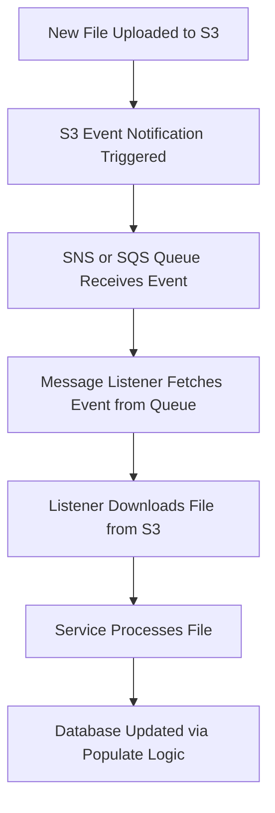

## Q1: 

### 1. Code Quality and Standards
**Action Steps:**
- **Linting & Formatting:** Ensure the code adheres to a consistent style using ESLint and Prettier. Resolve existing linting issues.
- **Code Reviews:** Implement peer reviews to maintain high code quality.

---

### 2. Robust Database Setup
**Action Steps:**
- **Migration Management:** Automate and thoroughly test database migrations. Verify that the `migrations` folder handles schema changes effectively.
- **Seeding and Rollback:** Test seeder files to ensure data can be reliably populated and rolled back when necessary.
- **Production Database:** Set up a reliable, scalable production database (e.g., AWS RDS for Postgres).
- **Backup Strategy:** Implement an automated backup solution for the database.
- **Replication:** Implement database replication system to avoid having a single point of failure.

---

### 3. Security Enhancements
**Action Steps:**
- **SQL Injection:**: Add sanitization logic to avoid users sending malicious code and access unauthorized data.
- **Authentication & Authorization:**
  - Service-to-Service Authentication: Use token-based authentication (e.g., JWT or mTLS) to ensure only authorized internal services can call the API.
  - IP Whitelisting: Limit access to the API by allowing requests only from known internal IP ranges or private VPC networks.
- **Security Audits:** Perform static code analysis and penetration testing to find vulnerabilities.

---

### 4. API Improvements
**Action Steps:**
- **Validation:** Use a library like `Zod` to validate incoming request payloads.
- **Error Handling:** Implement standardized error handling with proper HTTP status codes and meaningful messages.
- **Documentation:** Provide clear API documentation using tools like Swagger/OpenAPI.
- **Pagination:** A pagination **must** be implemented to improve performance and avoid crashes in the application.

---

### 5. Performance Optimization
**Action Steps:**
- **Query Optimization:** Analyze and optimize SQL queries to minimize latency (Especially when volume of data is increased).
- **Caching:** Add caching for frequently accessed data using Redis or a similar solution.
- **Load Testing:** Simulate production traffic and measure system performance using a tool like *k6*.

---

### 6. CI/CD Pipeline
**Action Steps:**
- **Automated Testing:** Integrate automatic tests into a CI pipeline (e.g., GitHub Actions, GitLab CI) that runs for each code change to ensure no new bugs get shipped to production.
- **Deployment Pipeline:** Create a CI/CD pipeline to automatically deploy changes to staging and production environments.

---

### 7. Monitoring and Logging
**Action Steps:**
- **Application Logs:** Use a centralized logging system (e.g., Datadog) for all logs.
- **Monitoring:** Implement application and infrastructure monitoring using Prometheus, Grafana, or New Relic.
- **Alerting:** Set up alerts for critical issues like high response times or errors.

---

### 8. Scalability and Availability
**Action Steps:**
- **Horizontal Scaling:** Use container orchestration tools like Kubernetes to scale the API horizontally.
- **Load Balancing:** Use a load balancer to distribute traffic across instances.

## Q2: 
When new data files are uploaded to the S3 bucket, we can automate the process of detecting these updates and ingesting the data immediately by using an event-driven system. This approach ensures that updates happen in near real-time without requiring manual intervention or periodic checks.

Event Notifications from S3:

Amazon S3 has a feature called [Event Notifications](https://docs.aws.amazon.com/AmazonS3/latest/userguide/EventNotifications.html), which can detect specific actions, such as when a new file is uploaded.
Whenever a file is added, S3 sends a notification (a message) to a connected service like SNS (Simple Notification Service) or SQS (Simple Queue Service).
Message Listener:

The backend service will run a message listener, which waits for new notifications from the SQS queue.
When a notification arrives, the listener retrieves details about the uploaded file (e.g., file name, location in the bucket) and downloads the file.
Data Ingestion:

After downloading, the service processes the file and updates the database using the logic in your populate API. This ensures the new data is integrated into our system as soon as it's available.

